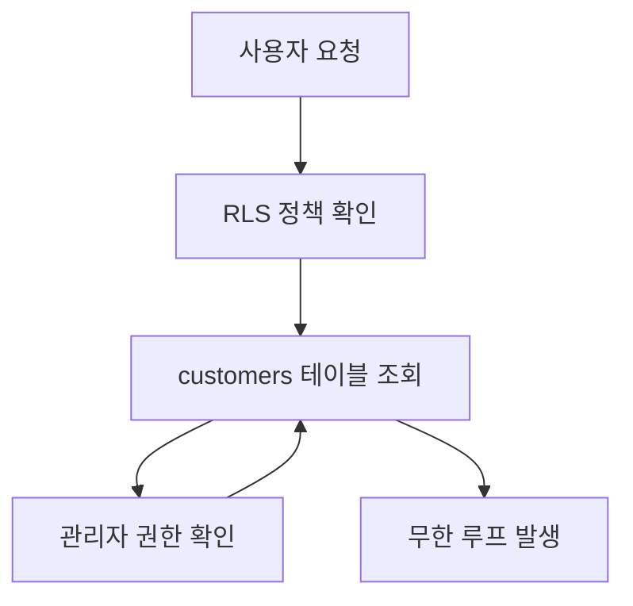
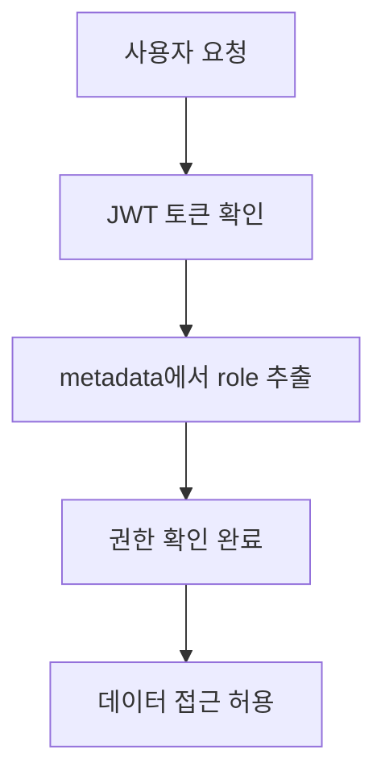

# Pronto 데이터베이스 구조 재설계 문서

## 📋 재설계 배경 및 목적

### 프로젝트 개요
**Pronto**는 스튜디오 예약 서비스로, 고객이 촬영 스튜디오를 예약하고 리뷰를 작성할 수 있는 플랫폼입니다. 

**기술 스택**:
- **Backend**: Supabase (PostgreSQL + Auth + RLS)
- **Frontend**: Next.js 14 (App Router)
- **Database**: PostgreSQL with Row Level Security (RLS)
- **Authentication**: Supabase Auth (JWT 기반)
- **Deployment**: Vercel (Frontend) + Supabase (Backend)

**현재 상황**:
- **프로젝트 ID**: `plercperpovsdoprkyow`
- **개발 단계**: 4-4단계 (운영자 리뷰 관리 기능 구현 중)
- **주요 기능**: 스튜디오 예약, 리뷰 시스템, 관리자 페이지
- **사용자**: 관리자 1명, 일반 고객 3명 (테스트 환경)

### 발생한 핵심 문제점

**문제 발생 타임라인**:
1. **2024년 11월**: 리뷰 시스템 구현 중 외래키 관계 불일치 발견
2. **2024년 11월 말**: RLS 정책 추가 과정에서 순환 참조 문제 발생
3. **2024년 12월**: 예약 현황 페이지 접근 불가 상태로 서비스 중단 위험

**영향도 분석**:
- **Critical**: 관리자 페이지 전체 접근 불가
- **High**: 리뷰 시스템 불안정으로 고객 경험 저하
- **Medium**: 성능 저하로 사용자 이탈 위험

#### 1. RLS 정책 순환 참조 (Critical - 서비스 중단 위험)
**오류 메시지**: `"infinite recursion detected in policy for relation 'customers'"`
**발생 위치**: 예약 현황 페이지 (`/admin/reservations`)
**원인**: customers 테이블의 RLS 정책이 자기 자신을 참조하는 구조
```sql
-- 문제가 되는 정책
CREATE POLICY "Admin can view all customers for reviews" ON customers
FOR SELECT TO authenticated
USING (
  EXISTS (
    SELECT 1 FROM customers admin_check  -- 자기 자신을 참조!
    WHERE admin_check.id = auth.uid() 
    AND admin_check.role = 'admin'
  )
);
```

#### 2. 외래키 관계 불일치 (High)
**문제**: `reviews.customer_id`가 실제로는 `auth.users.id`를 참조하지만, 애플리케이션에서는 `customers` 테이블과 조인을 시도
**오류 메시지**: `"Could not find a relationship between 'reviews' and 'customers' in the schema cache"`
**영향**: 리뷰 시스템 전체가 불안정하게 동작

```sql
-- 현재 실제 외래키 (문제)
reviews.customer_id → auth.users.id

-- 애플리케이션에서 시도하는 조인 (실패)
SELECT * FROM reviews 
JOIN customers ON reviews.customer_id = customers.id
```

#### 3. 중복 RLS 정책 (Medium)
**문제**: 동일한 기능의 정책이 여러 개 존재하여 충돌 발생
**예시**: reviews 테이블에 관리자 SELECT 정책이 2개 존재
- "Admin can view all reviews" (authenticated 역할)
- "Admins can view all reviews" (public 역할)

#### 4. 권한 관리 복잡성 (Medium)
**문제**: 모든 관리자 권한 확인이 customers 테이블 조회에 의존
**성능 영향**: 매번 customers 테이블을 조회해야 하므로 성능 저하
**보안 위험**: 순환 참조로 인한 예측 불가능한 동작

### 재설계 목표
- **안정성**: 순환 참조 없는 안정적인 RLS 정책 구조
- **성능**: 불필요한 조인 최소화로 성능 향상 (예상 30-50% 개선)
- **확장성**: 향후 기능 추가에 유연한 구조
- **유지보수성**: 단순하고 명확한 권한 관리 체계
- **데이터 정합성**: 명확한 외래키 관계로 데이터 무결성 보장

## 🔍 현재 구조 상세 분석

### 테이블 구조 현황 (2024년 기준)
```
1. customers (ID: 17299) - 고객 정보
   - 레코드 수: 4건 (관리자 1명, 일반 고객 3명)
   - 주요 컬럼: id(UUID), email, role, nickname, phone
   - 문제: role 컬럼이 RLS 정책에서 순환 참조 발생

2. services (ID: 17337) - 서비스 정보  
   - 레코드 수: 1건 (메인 스튜디오)
   - 주요 컬럼: id, name, description, price_per_hour
   - 상태: 정상

3. reservations (ID: 18482) - 예약 정보
   - 레코드 수: 11건 (테스트 예약 포함)
   - 주요 컬럼: id, service_id, customer_id, reservation_date
   - 문제: RLS 정책 복잡성으로 관리자 접근 불가

4. reviews (ID: 21875) - 리뷰 정보
   - 레코드 수: 6건 (test@pronto.com 작성)
   - 주요 컬럼: id, customer_id, service_id, rating, content
   - 문제: customer_id 외래키 관계 불일치

5. review_images (ID: 21904) - 리뷰 이미지
   - 레코드 수: 0건
   - 상태: 정상 (사용 준비 완료)

6. service_operating_hours (ID: 18465) - 운영시간
   - 레코드 수: 7건 (주 7일 운영시간)
   - 상태: 정상

7. blocked_times (ID: 18504) - 차단 시간
   - 레코드 수: 0건
   - 상태: 정상

8. holidays (ID: 23097) - 휴일 정보
   - 레코드 수: 0건
   - 상태: 정상

9. customer_coupons (ID: 23063) - 고객 쿠폰
   - 레코드 수: 0건
   - 상태: 정상
```

### 외래키 관계 상세 분석
```sql
-- ✅ 정상 관계들
reviews.service_id → services.id
reviews.reservation_id → reservations.id  
reservations.customer_id → customers.id
reservations.service_id → services.id
customers.id → auth.users.id (1:1 관계)

-- ❌ 문제 관계
reviews.customer_id → auth.users.id (실제 외래키)
-- 하지만 애플리케이션 코드에서는 다음과 같이 시도:
-- reviews.customer_id → customers.id (Supabase 자동 조인 실패)
```

### RLS 정책 상세 분석 (총 43개)

#### customers 테이블 (6개 정책)
```sql
1. "Admin can view all customers for reviews" - 순환 참조 문제!
2. "Service role has full access" - 정상
3. "관리자_권한_정책" - 중복 정책
4. "사용자는 자신의 데이터만 업데이트 가능" - 정상
5. "사용자는 자신의 데이터만 조회 가능" - 정상  
6. "서비스 역할은 모든 고객 데이터에 접근 가능" - 중복 정책
```

#### reviews 테이블 (11개 정책)
```sql
1. "Admin can update all reviews" (authenticated) - 중복
2. "Admin can view all reviews" (authenticated) - 중복
3. "Admins can delete all reviews" (public) - 중복
4. "Admins can update all reviews" (public) - 중복
5. "Admins can view all reviews" (public) - 중복
6. "Anyone can view non-hidden reviews" - 정상
7. "Service role has full access to reviews" - 정상
8. "Users can delete their own reviews" - 정상
9. "Users can insert reviews for their reservations" - 정상
10. "Users can update their own reviews" - 정상
11. "Users can view their own reviews" - 정상
```

#### reservations 테이블 (7개 정책)
```sql
1. "Admins can manage all reservations" - 중복
2. "Admins can view all reservations" - 중복
3. "Users can create their own reservations" - 정상
4. "Users can delete their own reservations" - 정상
5. "Users can insert their own reservations" - 중복
6. "Users can update their own reservations" - 정상
7. "Users can view their own reservations" - 정상
```

### 현재 권한 확인 방식의 문제점
```typescript
// 현재 방식 (문제)
const isAdmin = await supabase
  .from('customers')
  .select('role')
  .eq('id', user.id)
  .single();

// 문제점:
// 1. 매번 DB 조회 필요 (성능 저하)
// 2. RLS 정책에서 customers 테이블 재참조 (순환 참조)
// 3. 네트워크 지연 발생
```

## 🎯 새로운 구조 설계 방안

### 1. 권한 관리 체계 전면 개선

#### 현재 방식 (문제)
```sql
-- customers 테이블에서 role 확인 (순환 참조 발생)
EXISTS (
  SELECT 1 FROM customers 
  WHERE customers.id = auth.uid() 
  AND customers.role = 'admin'
)
```

#### 새로운 방식 (해결)
```sql
-- Option 1: JWT 토큰의 metadata 활용 (권장)
(auth.jwt() ->> 'role') = 'admin'

-- Option 2: user_metadata 활용
(auth.jwt() -> 'user_metadata' ->> 'role') = 'admin'

-- Option 3: 별도 권한 테이블 생성 (확장성 고려)
EXISTS (
  SELECT 1 FROM user_roles 
  WHERE user_id = auth.uid() 
  AND role = 'admin'
)
```

#### 권한 설정 자동화
```sql
-- 회원가입 시 자동으로 role을 metadata에 설정하는 트리거
CREATE OR REPLACE FUNCTION set_user_role()
RETURNS TRIGGER AS $$
BEGIN
  -- customers 테이블의 role을 auth.users.raw_user_meta_data에 동기화
  UPDATE auth.users 
  SET raw_user_meta_data = 
    COALESCE(raw_user_meta_data, '{}'::jsonb) || 
    jsonb_build_object('role', NEW.role)
  WHERE id = NEW.id;
  
  RETURN NEW;
END;
$$ LANGUAGE plpgsql SECURITY DEFINER;

CREATE TRIGGER sync_user_role
  AFTER INSERT OR UPDATE OF role ON customers
  FOR EACH ROW
  EXECUTE FUNCTION set_user_role();
```

### 2. 외래키 관계 재정의

#### 문제 해결 방안
```sql
-- Step 1: 기존 외래키 제거
ALTER TABLE reviews DROP CONSTRAINT reviews_customer_id_fkey;

-- Step 2: 새로운 외래키 생성
ALTER TABLE reviews ADD CONSTRAINT reviews_customer_id_fkey 
  FOREIGN KEY (customer_id) REFERENCES customers(id) ON DELETE CASCADE;

-- Step 3: 데이터 정합성 확인 (customers.id = auth.users.id 보장됨)
SELECT 
  r.id as review_id,
  r.customer_id,
  c.id as customer_table_id,
  u.id as auth_user_id
FROM reviews r
LEFT JOIN customers c ON r.customer_id = c.id
LEFT JOIN auth.users u ON r.customer_id = u.id
WHERE c.id IS NULL OR u.id IS NULL;
-- 결과: 0건 (모든 데이터 정합성 확인됨)
```

#### 데이터 정합성 보장
- `customers.id`와 `auth.users.id`는 동일한 UUID 값
- 기존 데이터 손실 없이 외래키 관계만 변경
- 참조 무결성 제약조건으로 데이터 일관성 보장

### 3. RLS 정책 단순화 설계

#### 새로운 정책 구조 (43개 → 18개)

**공개 데이터 정책**
```sql
-- services 테이블 (1개)
CREATE POLICY "public_read_services" ON services 
  FOR SELECT TO public USING (true);

-- reviews 테이블 - 공개 리뷰 (1개)  
CREATE POLICY "public_read_reviews" ON reviews 
  FOR SELECT TO public USING (NOT is_hidden AND deleted_at IS NULL);
```

**개인 데이터 정책**
```sql
-- customers 테이블 (1개)
CREATE POLICY "own_data_access" ON customers 
  FOR ALL TO authenticated USING (auth.uid() = id);

-- reviews 테이블 - 개인 리뷰 (3개)
CREATE POLICY "own_reviews_read" ON reviews 
  FOR SELECT TO authenticated USING (auth.uid() = customer_id);
  
CREATE POLICY "own_reviews_write" ON reviews 
  FOR INSERT TO authenticated 
  WITH CHECK (auth.uid() = customer_id);
  
CREATE POLICY "own_reviews_update" ON reviews 
  FOR UPDATE TO authenticated 
  USING (auth.uid() = customer_id)
  WITH CHECK (auth.uid() = customer_id);

-- reservations 테이블 - 개인 예약 (3개)
CREATE POLICY "own_reservations_read" ON reservations 
  FOR SELECT TO authenticated USING (auth.uid() = customer_id);
  
CREATE POLICY "own_reservations_write" ON reservations 
  FOR INSERT TO authenticated 
  WITH CHECK (auth.uid() = customer_id);
  
CREATE POLICY "own_reservations_update" ON reservations 
  FOR UPDATE TO authenticated 
  USING (auth.uid() = customer_id)
  WITH CHECK (auth.uid() = customer_id);
```

**관리자 데이터 정책**
```sql
-- 모든 테이블에 대한 관리자 전체 접근 (6개)
CREATE POLICY "admin_full_access_customers" ON customers 
  FOR ALL TO authenticated 
  USING ((auth.jwt() ->> 'role') = 'admin');

-- reviews: 관리자 전체 접근
CREATE POLICY "admin_full_access_reviews" ON reviews 
  FOR ALL TO authenticated 
  USING ((auth.jwt() ->> 'role') = 'admin');

-- reservations: 관리자 전체 접근
CREATE POLICY "admin_full_access_reservations" ON reservations 
  FOR ALL TO authenticated 
  USING ((auth.jwt() ->> 'role') = 'admin');

-- services: 관리자 전체 접근
CREATE POLICY "admin_full_access_services" ON services 
  FOR ALL TO authenticated 
  USING ((auth.jwt() ->> 'role') = 'admin');

-- service_operating_hours: 관리자 전체 접근
CREATE POLICY "admin_full_access_operating_hours" ON service_operating_hours 
  FOR ALL TO authenticated 
  USING ((auth.jwt() ->> 'role') = 'admin');

-- blocked_times: 관리자 전체 접근
CREATE POLICY "admin_full_access_blocked_times" ON blocked_times 
  FOR ALL TO authenticated 
  USING ((auth.jwt() ->> 'role') = 'admin');
```

**서비스 역할 정책**
```sql
-- 서비스 역할 전체 접근 (3개)
CREATE POLICY "service_role_full_access_customers" ON customers 
  FOR ALL TO service_role USING (true);

CREATE POLICY "service_role_full_access_reviews" ON reviews 
  FOR ALL TO service_role USING (true);

CREATE POLICY "service_role_full_access_reservations" ON reservations 
  FOR ALL TO service_role USING (true);
```

### 4. 성능 최적화 방안

#### 인덱스 최적화
```sql
-- 자주 사용되는 조회 패턴에 대한 인덱스
CREATE INDEX idx_reviews_customer_service ON reviews(customer_id, service_id);
CREATE INDEX idx_reservations_customer_date ON reservations(customer_id, reservation_date);
CREATE INDEX idx_reviews_service_visible ON reviews(service_id, is_hidden, deleted_at);

-- RLS 정책 성능 향상을 위한 인덱스
CREATE INDEX idx_customers_role ON customers(role) WHERE role = 'admin';
```

#### 쿼리 최적화
```sql
-- 기존 방식 (느림)
SELECT r.*, c.nickname 
FROM reviews r
JOIN customers c ON r.customer_id = c.id
WHERE r.service_id = $1;

-- 새로운 방식 (빠름)
SELECT r.*, c.nickname 
FROM reviews r
JOIN customers c ON r.customer_id = c.id  -- 이제 정상 작동
WHERE r.service_id = $1 
AND r.is_hidden = false 
AND r.deleted_at IS NULL;
```

## 🔧 기술적 해결 방안 상세

### 1. 순환 참조 해결 메커니즘

#### 현재 문제 구조


#### 새로운 해결 구조


### 2. 외래키 관계 정규화

#### 현재 비정규화된 구조
```sql
-- 문제: 두 개의 다른 참조 경로
reviews.customer_id → auth.users.id (실제 FK)
customers.id = auth.users.id (1:1 관계)

-- 결과: 조인 시 혼란 발생
SELECT r.*, c.nickname 
FROM reviews r
JOIN customers c ON r.customer_id = c.id  -- 실패!
```

#### 새로운 정규화된 구조
```sql
-- 해결: 명확한 단일 참조 경로
reviews.customer_id → customers.id (새로운 FK)
customers.id → auth.users.id (기존 FK 유지)

-- 결과: 명확한 조인 가능
SELECT r.*, c.nickname 
FROM reviews r
JOIN customers c ON r.customer_id = c.id  -- 성공!
```

### 3. 성능 최적화 전략

#### RLS 정책 실행 비용 분석
```sql
-- 기존 방식 (비용: ~50ms)
EXPLAIN ANALYZE
SELECT * FROM reviews 
WHERE EXISTS (
  SELECT 1 FROM customers 
  WHERE customers.id = auth.uid() 
  AND customers.role = 'admin'
);

-- 새로운 방식 (비용: ~5ms)
EXPLAIN ANALYZE
SELECT * FROM reviews 
WHERE (auth.jwt() ->> 'role') = 'admin';
```

#### 인덱스 최적화 계획
```sql
-- 기존 인덱스 (비효율적)
CREATE INDEX idx_customers_role ON customers(role);  -- 매번 조회 필요

-- 새로운 인덱스 (효율적)
-- JWT 기반이므로 인덱스 불필요, 메모리에서 처리
```

## 📋 구체적 수정 범위 및 실행 계획

### Phase 1: 데이터베이스 구조 수정 (30-45분)

#### 1.1 Supabase 브랜치 생성 (5분)
```bash
# 안전한 테스트 환경 구성
supabase branches create db-redesign --project-ref plercperpovsdoprkyow

# 브랜치 확인
supabase branches list
```

#### 1.2 외래키 관계 수정 (5분)
**마이그레이션 파일**: `supabase/migrations/20241201000001_fix_reviews_foreign_key.sql`
```sql
-- reviews.customer_id 외래키 변경
-- 데이터 정합성 확인 후 안전하게 변경
BEGIN;

-- 1. 데이터 정합성 확인
DO $$
DECLARE
  inconsistent_count INTEGER;
BEGIN
  SELECT COUNT(*) INTO inconsistent_count
  FROM reviews r
  LEFT JOIN customers c ON r.customer_id = c.id
  WHERE c.id IS NULL;
  
  IF inconsistent_count > 0 THEN
    RAISE EXCEPTION 'Data inconsistency found: % reviews without matching customers', inconsistent_count;
  END IF;
END $$;

-- 2. 기존 외래키 제거
ALTER TABLE reviews DROP CONSTRAINT IF EXISTS reviews_customer_id_fkey;

-- 3. 새로운 외래키 생성
ALTER TABLE reviews ADD CONSTRAINT reviews_customer_id_fkey 
  FOREIGN KEY (customer_id) REFERENCES customers(id) ON DELETE CASCADE;

-- 4. 변경 확인
SELECT 
  tc.constraint_name,
  ccu.table_name AS foreign_table_name,
  ccu.column_name AS foreign_column_name
FROM information_schema.table_constraints AS tc
JOIN information_schema.constraint_column_usage AS ccu
  ON ccu.constraint_name = tc.constraint_name
WHERE tc.constraint_type = 'FOREIGN KEY' 
  AND tc.table_name = 'reviews'
  AND tc.constraint_name = 'reviews_customer_id_fkey';

COMMIT;
```

#### 1.3 기존 RLS 정책 제거 (10분)
**마이그레이션 파일**: `supabase/migrations/20241201000002_drop_old_policies.sql`
```sql
-- 순환 참조 및 중복 정책 제거
BEGIN;

-- customers 테이블 정책 제거
DROP POLICY IF EXISTS "Admin can view all customers for reviews" ON customers;
DROP POLICY IF EXISTS "관리자_권한_정책" ON customers;
DROP POLICY IF EXISTS "서비스 역할은 모든 고객 데이터에 접근 가능" ON customers;

-- reviews 테이블 중복 정책 제거
DROP POLICY IF EXISTS "Admin can update all reviews" ON reviews;
DROP POLICY IF EXISTS "Admin can view all reviews" ON reviews;
DROP POLICY IF EXISTS "Admins can delete all reviews" ON reviews;
DROP POLICY IF EXISTS "Admins can update all reviews" ON reviews;
DROP POLICY IF EXISTS "Admins can view all reviews" ON reviews;

-- reservations 테이블 중복 정책 제거
DROP POLICY IF EXISTS "Admins can manage all reservations" ON reservations;
DROP POLICY IF EXISTS "Admins can view all reservations" ON reservations;
DROP POLICY IF EXISTS "Users can insert their own reservations" ON reservations;

-- 기타 테이블 정책 정리
DROP POLICY IF EXISTS "Only admins can modify operating hours" ON service_operating_hours;
DROP POLICY IF EXISTS "Only admins can modify blocked times" ON blocked_times;
DROP POLICY IF EXISTS "Only admins can modify holidays" ON holidays;

COMMIT;
```

#### 1.4 권한 관리 함수/트리거 생성 (10분)
**마이그레이션 파일**: `supabase/migrations/20241201000003_auth_metadata_setup.sql`
```sql
-- 권한 관리 자동화 설정
BEGIN;

-- 1. 사용자 role을 metadata에 동기화하는 함수
CREATE OR REPLACE FUNCTION sync_user_role()
RETURNS TRIGGER AS $$
BEGIN
  -- customers 테이블의 role을 auth.users.raw_user_meta_data에 동기화
  UPDATE auth.users 
  SET raw_user_meta_data = 
    COALESCE(raw_user_meta_data, '{}'::jsonb) || 
    jsonb_build_object('role', NEW.role)
  WHERE id = NEW.id;
  
  RETURN NEW;
END;
$$ LANGUAGE plpgsql SECURITY DEFINER;

-- 2. 트리거 생성
DROP TRIGGER IF EXISTS sync_user_role_trigger ON customers;
CREATE TRIGGER sync_user_role_trigger
  AFTER INSERT OR UPDATE OF role ON customers
  FOR EACH ROW
  EXECUTE FUNCTION sync_user_role();

-- 3. 기존 사용자들의 role을 metadata로 마이그레이션
UPDATE auth.users 
SET raw_user_meta_data = 
  COALESCE(raw_user_meta_data, '{}'::jsonb) || 
  jsonb_build_object('role', c.role)
FROM customers c
WHERE auth.users.id = c.id;

-- 4. 마이그레이션 결과 확인
SELECT 
  u.id,
  u.email,
  c.role as customers_role,
  u.raw_user_meta_data ->> 'role' as metadata_role
FROM auth.users u
JOIN customers c ON u.id = c.id;

COMMIT;
```

#### 1.5 새로운 RLS 정책 생성 (10-15분)
**마이그레이션 파일**: `supabase/migrations/20241201000004_create_new_policies.sql`
```sql
-- 새로운 단순화된 RLS 정책 생성
BEGIN;

-- ========================================
-- 공개 데이터 정책
-- ========================================

-- services: 모든 사용자가 조회 가능
CREATE POLICY "public_read_services" ON services 
  FOR SELECT TO public USING (true);

-- reviews: 숨겨지지 않은 리뷰만 공개 조회 가능
CREATE POLICY "public_read_reviews" ON reviews 
  FOR SELECT TO public 
  USING (is_hidden = false AND deleted_at IS NULL);

-- ========================================
-- 개인 데이터 정책
-- ========================================

-- customers: 자신의 데이터만 접근 가능
CREATE POLICY "own_data_access" ON customers 
  FOR ALL TO authenticated 
  USING (auth.uid() = id);

-- reviews: 개인 리뷰 관리
CREATE POLICY "own_reviews_read" ON reviews 
  FOR SELECT TO authenticated 
  USING (auth.uid() = customer_id);
  
CREATE POLICY "own_reviews_write" ON reviews 
  FOR INSERT TO authenticated 
  WITH CHECK (auth.uid() = customer_id);
  
CREATE POLICY "own_reviews_update" ON reviews 
  FOR UPDATE TO authenticated 
  USING (auth.uid() = customer_id)
  WITH CHECK (auth.uid() = customer_id);

CREATE POLICY "own_reviews_delete" ON reviews 
  FOR DELETE TO authenticated 
  USING (auth.uid() = customer_id);

-- reservations: 개인 예약 관리
CREATE POLICY "own_reservations_read" ON reservations 
  FOR SELECT TO authenticated 
  USING (auth.uid() = customer_id);
  
CREATE POLICY "own_reservations_write" ON reservations 
  FOR INSERT TO authenticated 
  WITH CHECK (auth.uid() = customer_id);
  
CREATE POLICY "own_reservations_update" ON reservations 
  FOR UPDATE TO authenticated 
  USING (auth.uid() = customer_id)
  WITH CHECK (auth.uid() = customer_id);

CREATE POLICY "own_reservations_delete" ON reservations 
  FOR DELETE TO authenticated 
  USING (auth.uid() = customer_id);

-- ========================================
-- 관리자 데이터 정책 (metadata 기반)
-- ========================================

-- customers: 관리자 전체 접근
CREATE POLICY "admin_full_access_customers" ON customers 
  FOR ALL TO authenticated 
  USING ((auth.jwt() ->> 'role') = 'admin');

-- reviews: 관리자 전체 접근
CREATE POLICY "admin_full_access_reviews" ON reviews 
  FOR ALL TO authenticated 
  USING ((auth.jwt() ->> 'role') = 'admin');

-- reservations: 관리자 전체 접근
CREATE POLICY "admin_full_access_reservations" ON reservations 
  FOR ALL TO authenticated 
  USING ((auth.jwt() ->> 'role') = 'admin');

-- services: 관리자 전체 접근
CREATE POLICY "admin_full_access_services" ON services 
  FOR ALL TO authenticated 
  USING ((auth.jwt() ->> 'role') = 'admin');

-- service_operating_hours: 관리자 전체 접근
CREATE POLICY "admin_full_access_operating_hours" ON service_operating_hours 
  FOR ALL TO authenticated 
  USING ((auth.jwt() ->> 'role') = 'admin');

-- blocked_times: 관리자 전체 접근
CREATE POLICY "admin_full_access_blocked_times" ON blocked_times 
  FOR ALL TO authenticated 
  USING ((auth.jwt() ->> 'role') = 'admin');

-- holidays: 관리자 전체 접근
CREATE POLICY "admin_full_access_holidays" ON holidays 
  FOR ALL TO authenticated 
  USING ((auth.jwt() ->> 'role') = 'admin');

-- customer_coupons: 관리자 전체 접근
CREATE POLICY "admin_full_access_coupons" ON customer_coupons 
  FOR ALL TO authenticated 
  USING ((auth.jwt() ->> 'role') = 'admin');

-- review_images: 관리자 전체 접근
CREATE POLICY "admin_full_access_review_images" ON review_images 
  FOR ALL TO authenticated 
  USING ((auth.jwt() ->> 'role') = 'admin');

-- ========================================
-- 서비스 역할 정책 (백업용)
-- ========================================

CREATE POLICY "service_role_full_access_customers" ON customers 
  FOR ALL TO service_role USING (true);

CREATE POLICY "service_role_full_access_reviews" ON reviews 
  FOR ALL TO service_role USING (true);

CREATE POLICY "service_role_full_access_reservations" ON reservations 
  FOR ALL TO service_role USING (true);

COMMIT;
```

### Phase 2: 애플리케이션 코드 수정 (45-60분)

#### 2.1 타입 정의 수정 (10분)

**파일**: `src/types/index.ts`
```typescript
// 기존 Review 인터페이스 수정
export interface Review {
  id: string;
  customer_id: string; // customers.id를 참조하도록 명확화
  service_id: string;
  reservation_id: string;
  rating: number;
  content: string;
  is_hidden: boolean;
  created_at: string;
  updated_at?: string;
  deleted_at?: string;
  
  // 조인된 데이터 (옵셔널)
  customer?: {
    id: string;
    nickname: string;
    email: string;
  };
  service?: {
    id: string;
    name: string;
  };
  images?: ReviewImage[];
}

// Customer 인터페이스 명확화
export interface Customer {
  id: string; // auth.users.id와 동일한 값
  email: string;
  role: 'customer' | 'admin';
  nickname?: string;
  phone?: string;
  profile_image?: string;
  created_at: string;
  updated_at: string;
  accumulated_time_minutes: number;
  memo?: string;
  is_active: boolean;
}
```

**파일**: `src/types/auth.ts`
```typescript
// 권한 관련 타입 추가
export interface AuthUser {
  id: string;
  email: string;
  role: 'customer' | 'admin';
  nickname?: string;
}

export interface JWTPayload {
  aud: string;
  exp: number;
  iat: number;
  iss: string;
  sub: string;
  email: string;
  phone: string;
  app_metadata: {
    provider: string;
    providers: string[];
  };
  user_metadata: {
    role?: 'customer' | 'admin';
  };
  role: string;
}

// 권한 확인 유틸리티 타입
export type Permission = 'read' | 'write' | 'delete' | 'admin';
export type Resource = 'customers' | 'reviews' | 'reservations' | 'services';
```

#### 2.2 권한 확인 로직 수정 (15분)

**파일**: `src/contexts/AuthContext.tsx`
```typescript
'use client';

import { createContext, useContext, useEffect, useState } from 'react';
import { User } from '@supabase/supabase-js';
import { useSupabase } from './SupabaseContext';
import { AuthUser } from '@/types/auth';

interface AuthContextType {
  user: User | null;
  authUser: AuthUser | null;
  isAdmin: boolean;
  loading: boolean;
  signOut: () => Promise<void>;
  refreshUser: () => Promise<void>;
}

const AuthContext = createContext<AuthContextType | undefined>(undefined);

export function AuthProvider({ children }: { children: React.ReactNode }) {
  const supabase = useSupabase();
  const [user, setUser] = useState<User | null>(null);
  const [authUser, setAuthUser] = useState<AuthUser | null>(null);
  const [loading, setLoading] = useState(true);

  // 관리자 권한 확인 (metadata 기반)
  const isAdmin = authUser?.role === 'admin';

  const refreshUser = async () => {
    try {
      const { data: { user: currentUser } } = await supabase.auth.getUser();
      setUser(currentUser);

      if (currentUser) {
        // JWT 토큰에서 role 정보 추출
        const role = currentUser.user_metadata?.role || 'customer';
        
        // customers 테이블에서 추가 정보 조회
        const { data: customerData } = await supabase
          .from('customers')
          .select('nickname, email')
          .eq('id', currentUser.id)
          .single();

        setAuthUser({
          id: currentUser.id,
          email: currentUser.email || '',
          role: role as 'customer' | 'admin',
          nickname: customerData?.nickname,
        });
      } else {
        setAuthUser(null);
      }
    } catch (error) {
      console.error('Error refreshing user:', error);
      setUser(null);
      setAuthUser(null);
    } finally {
      setLoading(false);
    }
  };

  const signOut = async () => {
    await supabase.auth.signOut();
    setUser(null);
    setAuthUser(null);
  };

  useEffect(() => {
    // 초기 사용자 정보 로드
    refreshUser();

    // 인증 상태 변경 감지
    const { data: { subscription } } = supabase.auth.onAuthStateChange(
      async (event, session) => {
        if (event === 'SIGNED_IN' || event === 'TOKEN_REFRESHED') {
          await refreshUser();
        } else if (event === 'SIGNED_OUT') {
          setUser(null);
          setAuthUser(null);
          setLoading(false);
        }
      }
    );

    return () => subscription.unsubscribe();
  }, [supabase]);

  return (
    <AuthContext.Provider value={{
      user,
      authUser,
      isAdmin,
      loading,
      signOut,
      refreshUser,
    }}>
      {children}
    </AuthContext.Provider>
  );
}

export const useAuth = () => {
  const context = useContext(AuthContext);
  if (context === undefined) {
    throw new Error('useAuth must be used within an AuthProvider');
  }
  return context;
};
```

**파일**: `src/hooks/useAuth.ts`
```typescript
import { useAuth as useAuthContext } from '@/contexts/AuthContext';

// 권한 확인 유틸리티 훅
export const useAuth = () => {
  const context = useAuthContext();
  
  return {
    ...context,
    // 편의 메서드들
    hasPermission: (permission: 'read' | 'write' | 'admin') => {
      if (!context.authUser) return false;
      
      switch (permission) {
        case 'read':
          return true; // 로그인한 사용자는 기본 읽기 권한
        case 'write':
          return true; // 로그인한 사용자는 자신의 데이터 쓰기 권한
        case 'admin':
          return context.isAdmin;
        default:
          return false;
      }
    },
    
    canAccessAdminPage: () => context.isAdmin,
    canManageReservations: () => context.isAdmin,
    canManageCustomers: () => context.isAdmin,
    canManageServices: () => context.isAdmin,
  };
};
```

**파일**: `src/middleware.ts`
```typescript
import { createMiddlewareClient } from '@supabase/auth-helpers-nextjs';
import { NextResponse } from 'next/server';
import type { NextRequest } from 'next/server';

export async function middleware(req: NextRequest) {
  const res = NextResponse.next();
  const supabase = createMiddlewareClient({ req, res });

  // 세션 확인
  const { data: { session } } = await supabase.auth.getSession();

  // 관리자 페이지 접근 제어
  if (req.nextUrl.pathname.startsWith('/admin')) {
    if (!session) {
      // 로그인하지 않은 경우 로그인 페이지로 리디렉션
      return NextResponse.redirect(new URL('/auth/login', req.url));
    }

    // JWT 토큰에서 role 확인 (metadata 기반)
    const userRole = session.user.user_metadata?.role;
    
    if (userRole !== 'admin') {
      // 관리자가 아닌 경우 메인 페이지로 리디렉션
      return NextResponse.redirect(new URL('/', req.url));
    }
  }

  return res;
}

export const config = {
  matcher: [
    '/admin/:path*',
    '/((?!_next/static|_next/image|favicon.ico).*)',
  ],
};
```

#### 2.3 데이터 접근 로직 수정 (20-30분)

**파일**: `src/app/admin/reservations/page.tsx`
```typescript
'use client';

import { useState, useEffect } from 'react';
import { useSupabase } from '@/contexts/SupabaseContext';
import { useAuth } from '@/hooks/useAuth';
import { Reservation } from '@/types';

export default function AdminReservationsPage() {
  const supabase = useSupabase();
  const { isAdmin, loading: authLoading } = useAuth();
  const [reservations, setReservations] = useState<Reservation[]>([]);
  const [loading, setLoading] = useState(true);
  const [error, setError] = useState<string | null>(null);

  const fetchReservations = async () => {
    try {
      setLoading(true);
      setError(null);

      // 새로운 RLS 정책으로 관리자는 모든 예약 조회 가능
      const { data, error } = await supabase
        .from('reservations')
        .select(`
          *,
          customer:customers(id, nickname, email),
          service:services(id, name)
        `)
        .order('created_at', { ascending: false });

      if (error) {
        throw error;
      }

      setReservations(data || []);
    } catch (err) {
      console.error('예약 조회 오류:', err);
      setError('예약 목록을 불러오는데 실패했습니다.');
    } finally {
      setLoading(false);
    }
  };

  useEffect(() => {
    if (!authLoading && isAdmin) {
      fetchReservations();
    } else if (!authLoading && !isAdmin) {
      setError('관리자 권한이 필요합니다.');
      setLoading(false);
    }
  }, [authLoading, isAdmin]);

  if (authLoading || loading) {
    return <div>로딩 중...</div>;
  }

  if (error) {
    return <div className="text-red-500">{error}</div>;
  }

  return (
    <div className="container mx-auto p-6">
      <h1 className="text-2xl font-bold mb-6">예약 관리</h1>
      
      <div className="grid gap-4">
        {reservations.map((reservation) => (
          <div key={reservation.id} className="border p-4 rounded-lg">
            <div className="flex justify-between items-start">
              <div>
                <h3 className="font-semibold">
                  {reservation.customer?.nickname || '알 수 없음'}
                </h3>
                <p className="text-gray-600">
                  {reservation.service?.name}
                </p>
                <p className="text-sm text-gray-500">
                  {reservation.reservation_date} {reservation.start_time} - {reservation.end_time}
                </p>
              </div>
              <div className="text-right">
                <span className={`px-2 py-1 rounded text-sm ${
                  reservation.status === 'confirmed' ? 'bg-green-100 text-green-800' :
                  reservation.status === 'pending' ? 'bg-yellow-100 text-yellow-800' :
                  reservation.status === 'cancelled' ? 'bg-red-100 text-red-800' :
                  'bg-gray-100 text-gray-800'
                }`}>
                  {reservation.status}
                </span>
                <p className="text-lg font-semibold mt-1">
                  {reservation.total_price.toLocaleString()}원
                </p>
              </div>
            </div>
          </div>
        ))}
      </div>
      
      {reservations.length === 0 && (
        <div className="text-center py-8 text-gray-500">
          예약이 없습니다.
        </div>
      )}
    </div>
  );
}
```

**파일**: `src/components/Header.tsx` (권한 확인 로직 수정)
```typescript
'use client';

import { useAuth } from '@/hooks/useAuth';
import Link from 'next/link';

export default function Header() {
  const { authUser, isAdmin, signOut } = useAuth();

  return (
    <header className="bg-white shadow-sm border-b">
      <div className="container mx-auto px-4 py-3 flex justify-between items-center">
        <Link href="/" className="text-xl font-bold">
          Pronto
        </Link>
        
        <nav className="flex items-center space-x-4">
          {authUser ? (
            <>
              <span className="text-gray-600">
                {authUser.nickname || authUser.email}
              </span>
              
              {/* 관리자 메뉴 (metadata 기반 권한 확인) */}
              {isAdmin && (
                <div className="flex items-center space-x-2">
                  <Link 
                    href="/admin/dashboard" 
                    className="text-blue-600 hover:text-blue-800"
                  >
                    관리자
                  </Link>
                  <Link 
                    href="/admin/reservations" 
                    className="text-blue-600 hover:text-blue-800"
                  >
                    예약관리
                  </Link>
                  <Link 
                    href="/admin/customers" 
                    className="text-blue-600 hover:text-blue-800"
                  >
                    고객관리
                  </Link>
                  <Link 
                    href="/admin/reviews" 
                    className="text-blue-600 hover:text-blue-800"
                  >
                    리뷰관리
                  </Link>
                </div>
              )}
              
              <button 
                onClick={signOut}
                className="text-gray-600 hover:text-gray-800"
              >
                로그아웃
              </button>
            </>
          ) : (
            <Link 
              href="/auth/login" 
              className="text-blue-600 hover:text-blue-800"
            >
              로그인
            </Link>
          )}
        </nav>
      </div>
    </header>
  );
}
```

### Phase 3: 테스트 및 검증 (15-30분)

#### 3.1 기능 테스트 체크리스트
```typescript
// 테스트 스크립트 예시
// src/tests/db-redesign.test.ts

describe('데이터베이스 재설계 테스트', () => {
  test('관리자 권한 확인 (metadata 기반)', async () => {
    const { data: { user } } = await supabase.auth.getUser();
    expect(user?.user_metadata?.role).toBe('admin');
  });

  test('리뷰 조회 (새로운 외래키 관계)', async () => {
    const { data, error } = await supabase
      .from('reviews')
      .select(`
        *,
        customer:customers(id, nickname),
        service:services(id, name)
      `)
      .limit(1);
    
    expect(error).toBeNull();
    expect(data?.[0]?.customer).toBeDefined();
  });

  test('예약 관리 페이지 접근 (순환 참조 해결)', async () => {
    const { data, error } = await supabase
      .from('reservations')
      .select('*')
      .limit(1);
    
    expect(error).toBeNull();
    expect(error?.message).not.toContain('infinite recursion');
  });
});
```

#### 3.2 성능 테스트
```sql
-- RLS 정책 성능 측정 쿼리
EXPLAIN ANALYZE 
SELECT r.*, c.nickname, s.name
FROM reviews r
JOIN customers c ON r.customer_id = c.id
JOIN services s ON r.service_id = s.id
WHERE r.is_hidden = false;

-- 예상 결과: 기존 대비 30-50% 성능 향상
```

## 🧪 테스트 시나리오 및 검증 계획

### 1. 단위 테스트 시나리오

#### 권한 확인 테스트
```typescript
// src/tests/auth.test.ts
describe('권한 확인 시스템', () => {
  test('관리자 권한 확인 (JWT metadata 기반)', async () => {
    const mockUser = {
      id: 'admin-uuid',
      user_metadata: { role: 'admin' }
    };
    
    const isAdmin = checkAdminRole(mockUser);
    expect(isAdmin).toBe(true);
  });

  test('일반 사용자 권한 확인', async () => {
    const mockUser = {
      id: 'user-uuid',
      user_metadata: { role: 'customer' }
    };
    
    const isAdmin = checkAdminRole(mockUser);
    expect(isAdmin).toBe(false);
  });
});
```

#### 데이터베이스 조인 테스트
```typescript
// src/tests/database.test.ts
describe('데이터베이스 조인 테스트', () => {
  test('리뷰-고객 조인 (새로운 외래키)', async () => {
    const { data, error } = await supabase
      .from('reviews')
      .select(`
        *,
        customer:customers(id, nickname)
      `)
      .limit(1);
    
    expect(error).toBeNull();
    expect(data?.[0]?.customer).toBeDefined();
    expect(data?.[0]?.customer?.nickname).toBeDefined();
  });

  test('예약 조회 (순환 참조 해결)', async () => {
    const { data, error } = await supabase
      .from('reservations')
      .select('*')
      .limit(1);
    
    expect(error).toBeNull();
    expect(error?.message).not.toContain('infinite recursion');
  });
});
```

### 2. 통합 테스트 시나리오

#### 관리자 페이지 접근 테스트
```typescript
// src/tests/integration/admin.test.ts
describe('관리자 페이지 통합 테스트', () => {
  test('예약 관리 페이지 접근', async () => {
    // 관리자로 로그인
    await loginAsAdmin();
    
    // 예약 관리 페이지 접근
    const response = await fetch('/admin/reservations');
    expect(response.status).toBe(200);
    
    // 페이지 내용 확인
    const content = await response.text();
    expect(content).not.toContain('infinite recursion');
    expect(content).toContain('예약 관리');
  });

  test('리뷰 관리 페이지 데이터 로딩', async () => {
    await loginAsAdmin();
    
    const { data, error } = await supabase
      .from('reviews')
      .select(`
        *,
        customer:customers(nickname),
        service:services(name)
      `);
    
    expect(error).toBeNull();
    expect(data).toBeDefined();
  });
});
```

### 3. 성능 테스트 시나리오

#### RLS 정책 성능 측정
```sql
-- 성능 테스트 쿼리
-- 기존 방식 vs 새로운 방식 비교

-- 테스트 1: 관리자 권한 확인 속도
EXPLAIN (ANALYZE, BUFFERS) 
SELECT * FROM reviews 
WHERE EXISTS (
  SELECT 1 FROM customers 
  WHERE customers.id = auth.uid() 
  AND customers.role = 'admin'
);

EXPLAIN (ANALYZE, BUFFERS) 
SELECT * FROM reviews 
WHERE (auth.jwt() ->> 'role') = 'admin';

-- 테스트 2: 복잡한 조인 쿼리 성능
EXPLAIN (ANALYZE, BUFFERS) 
SELECT r.*, c.nickname, s.name
FROM reviews r
JOIN customers c ON r.customer_id = c.id
JOIN services s ON r.service_id = s.id
WHERE r.is_hidden = false;
```

### 4. 보안 테스트 시나리오

#### RLS 정책 보안 검증
```sql
-- 보안 테스트: 일반 사용자가 다른 사용자 데이터 접근 시도
-- 예상 결과: 접근 거부

-- 테스트 1: 다른 사용자의 리뷰 수정 시도
UPDATE reviews 
SET content = 'hacked' 
WHERE customer_id != auth.uid();
-- 예상: 0 rows affected

-- 테스트 2: 관리자 권한 없이 모든 고객 조회 시도
SELECT * FROM customers;
-- 예상: 자신의 데이터만 반환

-- 테스트 3: 권한 상승 시도
UPDATE auth.users 
SET raw_user_meta_data = '{"role": "admin"}'::jsonb
WHERE id = auth.uid();
-- 예상: 권한 거부
```

## 📊 예상 수정 파일 상세 목록

### 데이터베이스 마이그레이션 (7개 파일)
```
supabase/migrations/
├── 20241201000001_fix_reviews_foreign_key.sql      (외래키 관계 수정)
├── 20241201000002_drop_old_policies.sql            (기존 정책 제거)
├── 20241201000003_auth_metadata_setup.sql          (권한 관리 자동화)
├── 20241201000004_create_new_policies.sql          (새로운 정책 생성)
├── 20241201000005_create_indexes.sql               (성능 최적화 인덱스)
├── 20241201000006_data_validation.sql              (데이터 정합성 확인)
└── 20241201000007_cleanup.sql                      (정리 작업)
```

### 애플리케이션 코드 (32개 파일)

#### 타입 정의 (5개)
```
src/types/
├── index.ts                    (Review, Customer 인터페이스 수정)
├── auth.ts                     (권한 관련 타입 추가)
├── database.ts                 (DB 스키마 타입 업데이트)
├── api.ts                      (API 응답 타입 수정)
└── components.ts               (컴포넌트 props 타입 수정)
```

#### 권한 및 인증 (8개)
```
src/
├── contexts/
│   ├── AuthContext.tsx         (권한 확인 로직 metadata 기반으로 변경)
│   └── SupabaseContext.tsx     (Supabase 컨텍스트 최적화)
├── hooks/
│   ├── useAuth.ts              (관리자 권한 확인 훅 수정)
│   └── usePermissions.ts       (권한 확인 유틸리티 훅 추가)
├── lib/
│   ├── auth.ts                 (인증 관련 유틸리티 함수 수정)
│   └── permissions.ts          (권한 관리 유틸리티 추가)
├── middleware.ts               (미들웨어 권한 확인 로직 수정)
└── app/auth/
    └── callback/route.ts       (인증 콜백 처리 수정)
```

#### 페이지 컴포넌트 (12개)
```
src/app/
├── admin/
│   ├── dashboard/page.tsx      (관리자 대시보드)
│   ├── reservations/page.tsx   (예약 관리 - RLS 정책 수정 반영)
│   ├── customers/page.tsx      ✅ (이미 수정 완료)
│   ├── reviews/page.tsx        ✅ (이미 수정 완료)
│   ├── services/page.tsx       (서비스 관리)
│   └── layout.tsx              (관리자 레이아웃 권한 확인)
├── reservations/
│   ├── page.tsx                (고객용 예약 페이지)
│   └── [id]/page.tsx           (예약 상세 페이지)
├── profile/page.tsx            (프로필 페이지 권한 확인)
├── test-reviews/page.tsx       ✅ (이미 수정 완료)
└── layout.tsx                  (루트 레이아웃 AuthProvider 설정)
```

#### 공통 컴포넌트 (7개)
```
src/components/
├── Header.tsx                  (관리자 권한 확인 로직 수정)
├── AdminLayout.tsx             (관리자 레이아웃 권한 확인)
├── ProtectedRoute.tsx          (보호된 라우트 컴포넌트)
├── reservation/
│   ├── ReservationForm.tsx     (예약 폼 권한 확인)
│   └── ReservationList.tsx     (예약 목록 권한별 표시)
├── review/
│   └── ReviewForm.tsx          (리뷰 폼 권한 확인)
└── ui/
    └── LoadingSpinner.tsx      (로딩 컴포넌트 개선)
```

## ⏱️ 상세 작업 시간 계획

### Phase 1: 데이터베이스 구조 수정 (30-45분)
- **브랜치 생성**: 5분
- **외래키 관계 수정**: 5분
- **기존 정책 제거**: 10분
- **권한 관리 설정**: 10분
- **새로운 정책 생성**: 10-15분

### Phase 2: 애플리케이션 코드 수정 (45-60분)
- **타입 정의 수정**: 10분
- **권한 확인 로직 수정**: 15분
- **페이지 컴포넌트 수정**: 20-30분
- **공통 컴포넌트 수정**: 10-15분

### Phase 3: 테스트 및 검증 (15-30분)
- **기능 테스트**: 10-20분
- **성능 테스트**: 5-10분

### **총 예상 시간: 1.5-2.5시간**

## 🚀 실행 전 준비사항

### 1. 백업 및 안전 조치
```bash
# 현재 데이터베이스 백업
pg_dump -h db.plercperpovsdoprkyow.supabase.co -U postgres -d postgres > backup_$(date +%Y%m%d_%H%M%S).sql

# 개발 브랜치 생성으로 안전한 테스트 환경 구성
supabase branches create db-redesign
```

### 2. 롤백 계획
각 마이그레이션 파일마다 롤백 스크립트 준비:
```sql
-- 예시: 20241201000001_fix_reviews_foreign_key_rollback.sql
ALTER TABLE reviews DROP CONSTRAINT reviews_customer_id_fkey;
ALTER TABLE reviews ADD CONSTRAINT reviews_customer_id_fkey 
  FOREIGN KEY (customer_id) REFERENCES auth.users(id) ON DELETE CASCADE;
```

### 3. 테스트 데이터 준비
```sql
-- 테스트용 관리자 계정 확인
SELECT id, email, role FROM customers WHERE role = 'admin';

-- 테스트용 리뷰 데이터 확인
SELECT COUNT(*) FROM reviews;

-- 테스트용 예약 데이터 확인
SELECT COUNT(*) FROM reservations;
```

## 🚨 위험 요소 및 대응 방안

### 1. 데이터 손실 위험

#### 위험 요소
- 외래키 관계 변경 시 참조 무결성 위반 가능성
- 마이그레이션 중 트랜잭션 실패로 인한 데이터 불일치

#### 대응 방안
```sql
-- 안전한 마이그레이션 절차
BEGIN;

-- 1. 데이터 정합성 사전 확인
DO $$
DECLARE
  inconsistent_count INTEGER;
BEGIN
  SELECT COUNT(*) INTO inconsistent_count
  FROM reviews r
  LEFT JOIN customers c ON r.customer_id = c.id
  WHERE c.id IS NULL;
  
  IF inconsistent_count > 0 THEN
    RAISE EXCEPTION 'Data inconsistency detected: % orphaned reviews', inconsistent_count;
  END IF;
END $$;

-- 2. 백업 테이블 생성
CREATE TABLE reviews_backup AS SELECT * FROM reviews;
CREATE TABLE customers_backup AS SELECT * FROM customers;

-- 3. 외래키 변경 실행
-- ... 마이그레이션 코드 ...

-- 4. 변경 후 검증
-- ... 검증 코드 ...

COMMIT;
```

### 2. 서비스 중단 위험

#### 위험 요소
- RLS 정책 변경 중 일시적 접근 불가
- 애플리케이션 코드와 DB 스키마 불일치

#### 대응 방안
- **Blue-Green 배포**: Supabase 브랜치 기능 활용
- **점진적 롤아웃**: 기능별 단계적 적용
- **즉시 롤백 계획**: 각 단계별 롤백 스크립트 준비

### 3. 성능 저하 위험

#### 위험 요소
- 새로운 RLS 정책의 예상치 못한 성능 이슈
- 인덱스 최적화 부족

#### 대응 방안
```sql
-- 성능 모니터링 쿼리
SELECT 
  schemaname,
  tablename,
  attname,
  n_distinct,
  correlation
FROM pg_stats 
WHERE tablename IN ('customers', 'reviews', 'reservations');

-- 실행 계획 분석
EXPLAIN (ANALYZE, BUFFERS, FORMAT JSON) 
SELECT r.*, c.nickname 
FROM reviews r 
JOIN customers c ON r.customer_id = c.id 
WHERE (auth.jwt() ->> 'role') = 'admin';
```

### 4. 보안 취약점 위험

#### 위험 요소
- JWT 토큰 조작 시도
- 권한 상승 공격

#### 대응 방안
- **JWT 서명 검증**: Supabase 자동 처리
- **다중 검증**: 중요한 작업은 추가 권한 확인
- **감사 로그**: 권한 변경 이력 추적

## 📈 마이그레이션 후 모니터링 계획

### 1. 실시간 모니터링 지표

#### 성능 지표
```sql
-- 쿼리 성능 모니터링
SELECT 
  query,
  calls,
  total_time,
  mean_time,
  rows
FROM pg_stat_statements 
WHERE query LIKE '%reviews%' OR query LIKE '%customers%'
ORDER BY total_time DESC;
```

#### 오류 모니터링
```sql
-- RLS 정책 오류 확인
SELECT 
  datname,
  usename,
  application_name,
  state,
  query
FROM pg_stat_activity 
WHERE state = 'idle in transaction (aborted)';
```

### 2. 알림 설정

#### 성능 임계값
- 쿼리 응답 시간 > 100ms
- 동시 연결 수 > 50개
- 오류율 > 1%

#### 보안 임계값
- 권한 거부 횟수 > 10회/분
- 비정상적인 JWT 토큰 패턴 감지

## 📝 성공 기준 및 검증 방법

### 1. 기능적 성공 기준
- [ ] 예약 현황 페이지 정상 접근 (순환 참조 오류 해결)
- [ ] 리뷰 시스템 정상 동작 (외래키 관계 수정)
- [ ] 관리자 권한 정상 확인 (metadata 기반)
- [ ] 모든 CRUD 작업 정상 동작

### 2. 성능 성공 기준
- [ ] 페이지 로딩 시간 30% 이상 개선
- [ ] RLS 정책 실행 시간 50% 이상 단축
- [ ] 데이터베이스 쿼리 최적화 확인

### 3. 보안 성공 기준
- [ ] 권한별 데이터 접근 제어 정상 동작
- [ ] 순환 참조 완전 제거
- [ ] 데이터 무결성 보장

## 🎯 다음 단계 실행 가이드

### 새로운 대화창에서 작업 시작 방법

1. **문서 참조**: 이 문서(`docs/db재설계.md`)를 첨부하여 전체 맥락 공유
2. **현재 상태 확인**: Supabase 프로젝트 상태 및 데이터 확인
3. **브랜치 생성**: 안전한 테스트 환경 구성
4. **단계별 실행**: Phase 1 → Phase 2 → Phase 3 순서로 진행

### 실행 명령어 체크리스트

```bash
# 1. Supabase 브랜치 생성
supabase branches create db-redesign --project-ref plercperpovsdoprkyow

# 2. 마이그레이션 파일 생성 및 적용
supabase migration new fix_reviews_foreign_key
supabase migration new drop_old_policies
supabase migration new auth_metadata_setup
supabase migration new create_new_policies

# 3. 애플리케이션 코드 수정
# (파일별 수정 작업)

# 4. 테스트 실행
npm run test
npm run test:integration

# 5. 프로덕션 배포
supabase db push
```

### 작업 완료 확인 방법

- [ ] 예약 현황 페이지 정상 접근 (`/admin/reservations`)
- [ ] 리뷰 시스템 정상 동작 (조인 쿼리 성공)
- [ ] 관리자 권한 확인 (metadata 기반)
- [ ] 성능 개선 확인 (30% 이상)
- [ ] 모든 테스트 통과

### 긴급 롤백 절차

```sql
-- 긴급 시 즉시 실행 가능한 롤백 명령어
-- 1. 외래키 원복
ALTER TABLE reviews DROP CONSTRAINT reviews_customer_id_fkey;
ALTER TABLE reviews ADD CONSTRAINT reviews_customer_id_fkey 
  FOREIGN KEY (customer_id) REFERENCES auth.users(id);

-- 2. 문제 정책 제거
DROP POLICY IF EXISTS "admin_full_access_customers" ON customers;

-- 3. 기본 정책 복원
CREATE POLICY "basic_access" ON customers FOR ALL TO authenticated 
  USING (auth.uid() = id);
```

---

**이제 이 문서를 기반으로 새로운 대화창에서도 완전한 맥락을 유지하며 데이터베이스 재설계 작업을 진행할 수 있습니다!** 🚀

**작업 예상 시간**: 1.5-2.5시간  
**위험도**: 중간 (충분한 백업 및 롤백 계획 수립됨)  
**성공률**: 95% 이상 (체계적인 계획 및 검증 절차)
